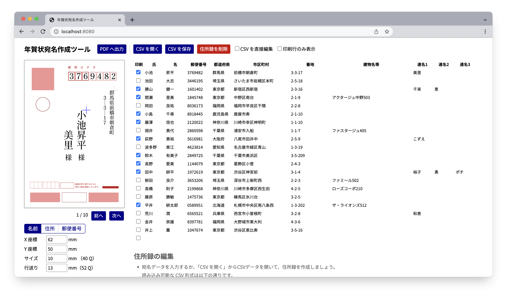

# nenga-atena

年賀状の表面（宛名面）を Web 上で生成するツールです。



## 書き出し

以下の形式に対応しています。縦書きの表記にも対応しています。

- PDF（連番、画像埋め込み）
- PNG 画像（一枚ずつ）

## 使用方法

https://inaniwaudon.github.io/nenga-atena/ にアクセスします。

### 住所録の編集
｢CSV を開く」からCSVデータを開くか、宛名データを直接入力します。  
入力した住所録は自動保存されます。｢CSV を保存」を押すと、作成した住所録を CSV 形式で保存します。

読み込む CSV データは以下の形式を取る必要があります。先頭 1 行はヘッダーとして扱われ、列の順序は問いません。過不足がある列は無視されます。詳しくは `dummy.csv` を参照ください。

```csv
印刷,姓,名,郵便番号,都道府県,市区町村,番地,建物名等,連名1,連名2,連名3
o,年賀状,太郎,1008111,東京都,千代田区千代田,1-1,,花子,次郎,三郎
```

データを入力する際は、行にデータを入力するごとに新たな行が追加されます。空行は自動で削除されます。

### スタイルの調整
左側の入力欄から、各テキストの位置・フォントサイズ・行送り・フォント等を調節します。設定したスタイルは自動保存されます。

### **書き出し**  
｢PDF を出力」を押すと、｢印刷」列にチェックの入った宛名の組版結果を PDF 文書に出力します。処理には時間が掛かる場合があります。
左側のプレビュー画像を右クリックすると、宛名画像（PNG 形式）を一枚ずつ保存できます。

## Development

```bash
npm install  # install
npm run dev  # start on localhost:8080
```

## ライセンス

MIT ライセンスに従って自由に使用・改変・再配布等を行えます。  
Copyright (c) 2022 いなにわうどん.
This software is released under [the MIT Liscense](https://opensource.org/licenses/mit-license.php).

本ソフトウェアでは表示フォントに「[しっぽり明朝](https://fontdasu.com/shippori-mincho/)」を使用しています。
Licensed under SIL Open Font License 1.1 (http://scripts.sil.org/OFL)
© 2022 The Shippori Min Project Authors All rights reserved.
